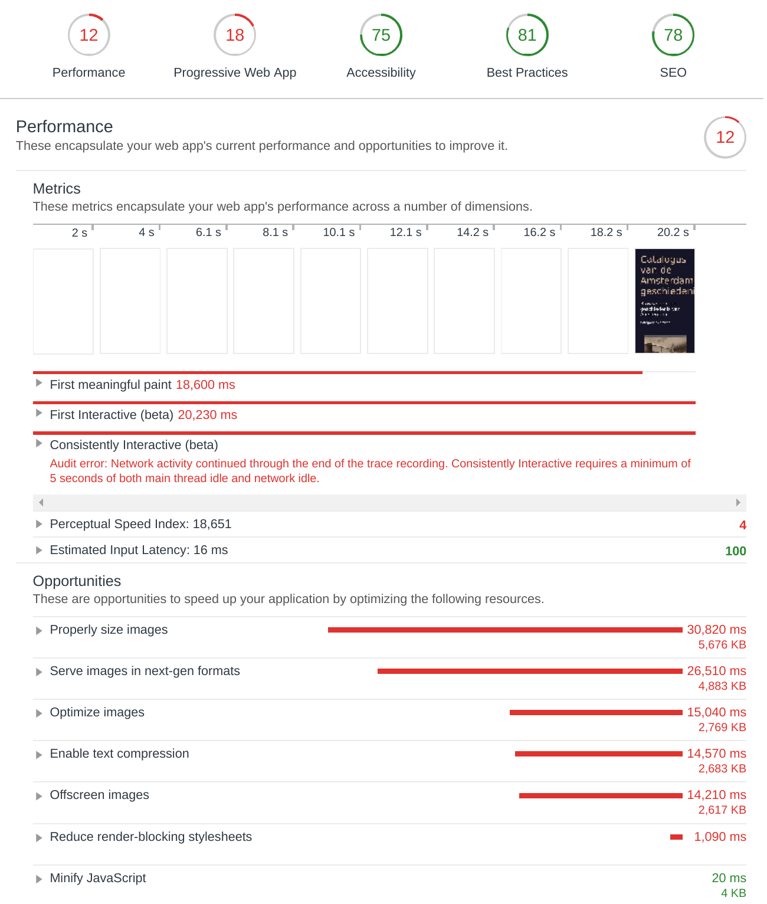
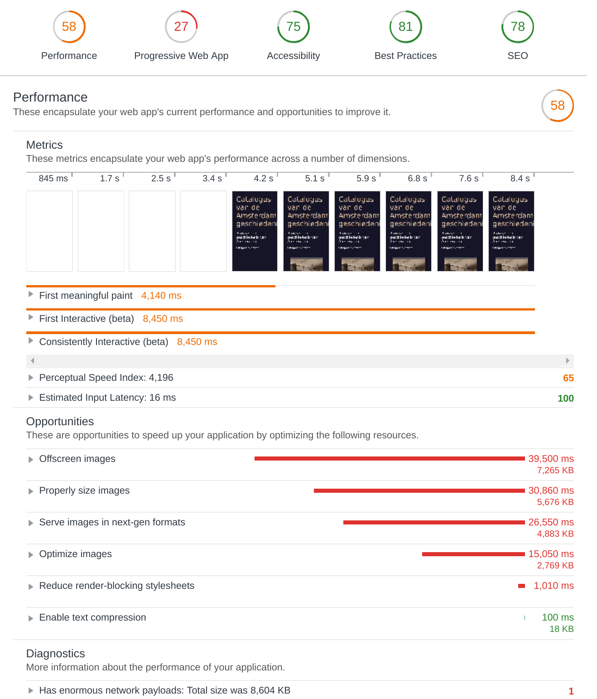
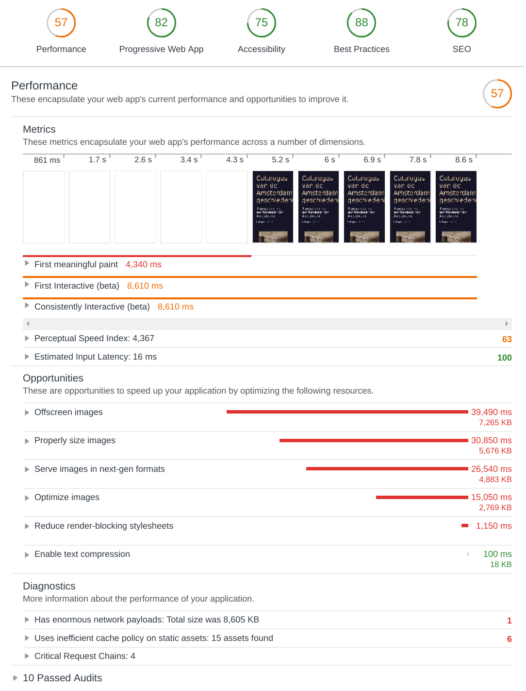

# Performance matters server side

### Getting started

To run the project

```
yarn install
```

Or

```
npm install
```

And to start it

```
yarn start
```

### Server side rendering

The website is a Single page application that with the help of server side rendering is rendered on the server. Because of this the entire website works without JavaScript.

Thanks to this the website is (partially) progressive enhanced. The JavaScript is compiled from es6 to es5 using
`browserify` and 'babel' but there is also an es6 modules version for the browsers that support this feature.

### Isomorphic app

From the start of this project (performance matters server side, not the project for the oba) I wanted to make it so that the server and client both shared the same templates. This as a nice challenge for myself and also to minimize the amout of code that needs to be written/edited twice.

Thanks to the `render` function in the [ejs] templating engine building this was alot easier than at first thought. Now all I needed to do was create the `ejs` files in a way that they could be reused and make sure the data was the same in both client and server.

[ejs]: http://ejs.co/

### Optimizations

Though there is still a lot of things that can be done, the optimizations that I did do made a huge difference.

Now one thing a did which is more of a small optimalization is create a JavaScript version for modules and nomodules. A newer browser can then take advantage of this module version if it has HTTP/2 enabled. Which, seeing I will be hosting it myself, entirely up to me (so yes this will a benefit).

The biggest impact probebly came from using [compression]. This is a npm package that will enable `gzip` and `deflate` for your website.

[compression]: https://github.com/expressjs/compression

### Audits

Before



After



After service worker


